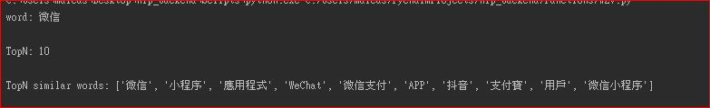

# Introduction

This project is part of the NLP application project to perform keyword extraction adn relevant articles recommendation for both ETNet financial news and CMS articles.

The backend facilties of NLP application is divided into three key components: data retrival, nlp backend engine and nlp middle-tier application.

The scripts of  data retrival and NLP middle-tier application are stored in https://github.com/etnetapp-dev/nlp_middle_tier and this repository is focused on NLP backend engine with multiple NLP function, e.g., name entity recognition (NER), word segmentation (tokenization), word2vector functions, and fuzz logic, etc.

The module is mainly built by python3.7, and one server script of Natural Language Processing (NLP) application.

# **Structure of NLP application project**

## Three main Components

The whole module pipeline is built at sequential order. To build the module in server, you have to run the scripts at pre-defined sequences.
1. [Data Retrieval](https://github.com/etnetapp-dev/app2app_nlp/tree/master/data_source)  - extract data from external APIs (data incl., news, lifestyle, theme and stocknames)
2. [NLP backend  enging](https://github.com/etnetapp-dev/app2app_nlp/tree/master/backend)  - Background NLP functions pending for called by other applications with internal APIs (key NLP backend functions: jieba word segmentation (jieba), Name entity recognition (NER), keyword extraction (combining the features of jieba + NER) and word2vec )
3. [NLP application ](https://github.com/etnetapp-dev/app2app_nlp/tree/master/text_processing/keywords_vectorizer)  - extract articles from SQL DB and calculate NLP results by the internal APIs of backend engine 

 
 
# Data Retrieval 

**Pre-requisite procedures**: connection and configuration of SQLDB
     please refer to the documentation in https://github.com/etnetapp-dev/nlp_middle_tier

# **Natural Language Processing (NLP) application **

**Flow-chart of NLP application/server**

# NLP Backend-engine 

The overall backend engine formed by four components:
- Config folder : to store the all config in the yaml folders and script to convert data from yaml into python OOP objects
- database folder:  to connect python script to SQL database and store CRUD script of python-sql 
- models folder: to store the models and model related data e,g. vocab, jieba dictionary and word2vec models
- functions folder:  to load all nlp models to memory and apply functions for NLP applications.

All NLP functions are called by API router pecified in hug_server.py.

The hug_server.py is the key API interface scripts to concentrate all NLP application and map the function to corresponding API routes based on the API route config stored in yaml folders of Config folder.

- Server IP: 10.200.23.42
- Port:  {please refer to API_config.yaml in Config folder}
- folder path: /opt/etnet/nlp_backend

# **Procedures of background service of app2app python modules in linux server**

### basic information
Python script: hug_server.py
Config file: yaml files in /Config/yamls
End-point: API routes specified in /Config/yaml/API_Config.yaml 

### Direct run command : 
     python3.7  /opt/etnet/nlp_backend/hug_server.py
     python3.7  <folder path>/hug_server.py

### Service run command
#### create and edit “lp_backend” script
     vim /opt/etnet/scripts/nlp_backend
   
Note: mainly input “direct run command” in between start) and exit $?

#### create and edit “app2app-backend-engine.service” in “/usr/lib/systemd/system/” folder
     vim /usr/lib/systemd/system/nlp_backend.service
   

#### run the .service in the background with “systemctl start” command
     systemctl start nlp_backend.service

### The background service is run on background in server, called function by API url shown below.

# Four key functions of nlp_backend

##  jieba word segmentation
> - Pre-requisite files: [userdict.txt](https://github.com/etnetapp-dev/nlp_backend/tree/master/models/seg/userdict.txt) , [stopwords.txt](https://github.com/etnetapp-dev/nlp_backend/tree/master/models/seg/stopwords.txt) -- config paths are stored in [model_Config.yaml](https://github.com/etnetapp-dev/nlp_backend/tree/master/Config/yamls/model_Config.yaml))   and [jieba handler script](https://github.com/etnetapp-dev/nlp_backend/tree/master/functions/cseg.py))
> - Requests method: post
> - Data sent: text sentence (datatype: string)
> - Response: word segments (datatype: list)
> 
### work segmentation example (jieba.cut)

- API: http://10.200.23.42:{post}/nlp_backend/seg/cut
 
   

--------------------------------------------------------------------------------------------------------------------------------------------------------------------------

## Name Entity Recognition (NER) 

- API: http://10.200.23.42:{post}/nlp_backend/ner/main
 
> - Pre-requisite dependencies:  ([model](https://github.com/etnetapp-dev/nlp_backend/tree/master/models/ner/) and [model handler script](https://github.com/etnetapp-dev/nlp_backend/tree/master/functions/ner.py)), installation of open library: [huggingface Transformer](https://huggingface.co/docs/transformers/index)
> - Request method: post
> - Data in request: str
> - response: json
### Name Entity Recognition example 
   

### Type of Name Entity example 
   

--------------------------------------------------------------------------------------------------------------------------------------------------------------------------

## word2vec 
Pre-requisite files: boc_app.bin (size ~170M too large to upload to github) , [stopwords.txt](https://github.com/etnetapp-dev/nlp_backend/tree/master/models/seg/stopwords.txt), 
installation of open-library : [magnitude-light](https://github.com/davebulaval/magnitude-light)

### convert word to vector example 

- API: http://10.200.23.42:{post}/nlp_backend//w2v/tovec
 
  
 
 ### word vs words similarity analysis example 
 
- API: http://10.200.23.42:{post}/nlp_backend/w2v/wordssim
 
  
 
 ### use word2vec model to find out top N words with semantic similarity meaning example 
 
- API: http://10.200.23.42:{post}/nlp_backend/w2v/topn
 
  
 
 ### use word2vec model to deduplicate words with similarity meaning example 
 
- API: http://10.200.23.42:{post}/nlp_backend/w2v/dedupe
 
  
    
--------------------------------------------------------------------------------------------------------------------------------------------------------------------------

## fuzz logic of words
Pre-requisite files: installation of open library: [rupidfuzz](https://github.com/maxbachmann/RapidFuzz) ,
 
 ### use fuzz logic to check similarity between words and word list example 
 
- API: http://10.200.23.42:{post}/nlp_backend/fuzz/wordssim
 
  

### use fuzz logic to deduplicate words in word list example 
 
- API: http://10.200.23.42:{post}/nlp_backend/fuzz/dedupe
 
  
 
 ### use fuzz logic to check any word with very close meaning  example 
 
- API: http://10.200.23.42:{post}/nlp_backend/fuzz/checkdupe
 
  

 

--------------------------------------------------------------------------------------------------------------------------------------------------------------------------   

##
# ** Design and structure of SQL Database **
In development stage, the project database is stored in 10.1.8.19 server with schema named : "app2app"

There are 16 tables in development database schema. Two of them ('apscheduler_jobs' AND 'ner') are only for test purpose, hence, The two tables will not be used/transfered in UAT/production environment.

Thus, totally 14 table in the sql.dump file are stored at the path */sql_db/dump_file/* of this repository.

To streamline the database migration, the db_dump files are seperated into data file (dbdump_data.sql) and structure file (dbdump_structure.sql).

The data dump file (dbdump_data.sql) has size of ~50M , hence, is not uloaded to github respository.

## Usages of Tables
Tables in app2app schema can be divided into four main groups based on their functions/attributes:

### news-related:
- news_article
- news_vectors
- news_category
- news_related_category

### lifestyle-related:
- lifestyle_articles
- lifestyle_vectors
- lifestyle_section
- lifestyle_category
- lifestyle_related_category
- lifestyle_tortags
- lifestyle_tortags_tags

### theme-related:
- theme

### stocknames-related:
- stocknames

## Tables structures of  app2app Schema :
 
 
#### 

## ER Diagram of tables serving **news articles**
 
#### 
 | tablename | purpose |
| :---: | :---: | 
| news_articles | store general information of news articles | 
| news_vectors | store NLP outputs of news articles, including, keywords (json format) and vector (array format) | 
| news_category | store categorial information of column : categoryCd of news articles | 
| news_related_category | store mapping relationship of news articles and categoryCd , build linkage between news_articles and news_category |   
  
#### 

 ## ER Diagram of tables serving  **lifestyle articles**  
 
 #### 

  
 | tablename | purpose |
| :---: | :---: | 
| lifestyle_articles | store general information of lifestyle articles | 
| lifestyle_vectors | store NLP outputs of lifestyle articles, including, keywords (json format) and vector (array format) | 
| lifestyle_section | store categorial information of column : section_id of catid | 
| lifestyle_category | store categorial information of column : catid of lifestyle articles | 
| lifestyle_related_category | store mapping relationship of catids, there is no direct linkage of lifestyle_related_category and lifestyle_articles | 
| lifestyle_tortags | store 1-to-many relationship of lifestyle articles and tags, build linkage betwwen lifestyle_articles and lifestyle_tortags_tags  |   
| lifestyle_tortags_tags | store information of tags ,including tag titles ,tagid, description and categorial information|   
#### 
## ER Diagram of tables serving  **theme and stocknames**   
 
#### 
    
 | tablename | purpose |
| :---: | :---: | 
| theme | store theme names, keywords and vectors. The records are scheduled to be udpated at 8:00am every working day |  
| stocknames | store full names of ~8000 stocks listed in HK,Shanghai and Shenzhen. The records are scheduled to be udpated at 8:00am every working day | 
