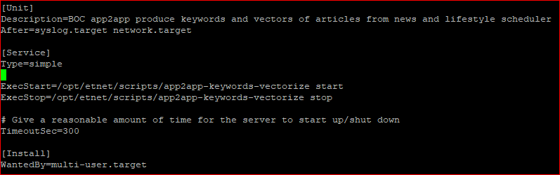

# Introduction
#### This project aims to  high level design of BOCHK OAPI Application, which is served as enhancement of stock searching in etnet Mobile Application. 

**App2app module**

App2app module, is a python-based module, aimed to serve as enhancement of stock searching and article-recommendation in etnet Mobile Application for the high level design of BOCHK OAPI project.

The module is mainly built by python3.7, and one server script of Natural Language Processing (NLP) application.

# **Structure of app2app module**

## Four main Components

The whole module pipeline is built at sequential order. To build the module in server, you have to run the scripts at pre-defined sequences.
1. [Data Retrieval](https://github.com/etnetapp-dev/app2app_nlp/tree/master/data_source)  - extract data from external APIs (data incl., news, lifestyle, theme and stocknames)
2. [NLP application (backend)](https://github.com/etnetapp-dev/app2app_nlp/tree/master/backend)  - Background NLP functions pending for called by other applications with internal APIs (key NLP backend functions: jieba word segmentation (jieba), Name entity recognition (NER), keyword extraction (combining the features of jieba + NER) and word2vec )
3. [NLP application (keyword+vector)](https://github.com/etnetapp-dev/app2app_nlp/tree/master/text_processing/keywords_vectorizer)  - extract articles from SQL DB and calculate NLP results by the internal APIs of backend engine 
3. [NLP application (theme-articles-mapping)](https://github.com/etnetapp-dev/app2app_nlp/tree/master/text_processing/theme_articles_mappingg)  - extract articles from SQL DB and calculate the most relevant articles of all themes. (notes: Main endpoint of app2app_nlp module and input of [app2app_web module](https://github.com/etnetapp-dev/app2app_web))

 
App2app Overall Module flow-chart (app2app_nlp + app2app_web ) 

 
 
# 1. Data Retrieval (schedulers)

**Pre-requisite procedures**: connection and configuration of SQLDB

###  Structure of data source folders: 
- [news folder](https://github.com/etnetapp-dev/app2app_nlp/tree/master/data_source/news) 
- [lifestyle folder](https://github.com/etnetapp-dev/app2app_nlp/tree/master/data_source/lifestyle) 
- [stockNames](https://github.com/etnetapp-dev/app2app_nlp/tree/master/data_source/stocknames) 
- [theme](https://github.com/etnetapp-dev/app2app_nlp/tree/master/data_source/theme) 

#### Each of data source folders contain four key scripts:
    - source_api.py  (structure requests function of external APIs in python scope)
    - schema.py (contains object-oriented (OOP) data model structure of data incoming from external APIs)
    - db_table.py ( contains tables' structure and relationship of mysql db in term of python scope)
    - CRUD.py  ( contains data-fetch functions of external APIs and Data I/O functions between modules and SQLDB )

#### External APIs of data: all are stored in [data_source.yaml](https://github.com/etnetapp-dev/app2app_nlp/blob/master/config/data_source.yaml)
    news:
        Content   : http://10.1.8.51/NewsServer/GetNewsContent.do
        Thumbnail : https://oapi2u.etnet.com.hk/NewsThumbnails/embed/GetNews.do
       
     lifestyle:
         article  : http://www.etnet.com.hk/apps/etnetapp/api/get_columns_data.php?type=latest
         category : http://www.etnet.com.hk/apps/etnetapp/api/get_columns_data.php?type=catinfo
         section  : http://www.etnet.com.hk/apps/etnetapp/api/get_columns_data.php?type=menu
       
     stocknames   : http://10.1.8.158/StreamServer/SortSearchServlet?reqID=6&category={}&sortFieldID=1&sort=A&from=0&size=5000&customFields=1,{}
     themenames   : http://10.1.8.10:5001/app2app/themedetails  
> note: for external API of themenames, the pre-requisite is the kick-start of running of theme_details.py from   [app2app_web module](https://github.com/etnetapp-dev/app2app_web)
>
>

## **Workflow of data retrieval of news, lifestyle columnist**

 

# **Natural Language Processing (NLP) application (Folder:/nlp\_app)**

**Flow-chart of NLP application/server**

# 2. NLP Backend-engine 
### The background service is run on background in server, called function by API url shown below. The [NLP backend engine](https://github.com/etnetapp-dev/app2app_nlp/blob/master/backend/engine.py) mainly performs four NLP functions:

- jieba word segmentation
> - Pre-requisite files: [userdict.txt](https://github.com/etnetapp-dev/app2app_nlp/tree/master/resources/userdict.txt) , [userdict_ner.txt](https://github.com/etnetapp-dev/app2app_nlp/tree/master/resources/userdict_ner.txt), [stopwords.txt](https://github.com/etnetapp-dev/app2app_nlp/tree/master/resources/stopwords.txt) -- config paths are stored in [data_files.yaml](https://github.com/etnetapp-dev/app2app_nlp/blob/master/config/data_files.yaml))
> - Requests method: post
> - Data sent: text sentence (datatype: string)
> - Response: word segments (datatype: list)

- Name Entity Recognition (NER) 
> - Pre-requisite dependencies:  ([model](https://github.com/etnetapp-dev/app2app_nlp/tree/master/resources/bert_model) and [model handler script](https://github.com/etnetapp-dev/app2app_nlp/blob/master/backend/ner_model_handler.py))
> - Request method: post
> - Data in request: str
> - response: json

- keywords scanning
> - Pre-requisite: completion of loading of NER model and Jieba text files
> - Requests method:post
> - Data sent: text sentence (datatype: string)
> - Response: word segments (datatype: list)

- word2vec 
Pre-requisite files: boc_app.bin (size ~170M too large to upload to github) , [ner_results.txt](https://github.com/etnetapp-dev/app2app_nlp/tree/master/resources/ner_results.txt) , [stopword.txt](https://github.com/etnetapp-dev/app2app_nlp/tree/master/resources/stopwords.txt)  

- word2vec API url: http://<host>\<port>/vectorizer
> - function: convert articles from string format into array format
> - Request method: post
> - data in request: article text
> - response: array

- word2vec API url:  http://<host>\<port>/vecsim
> - function: compare document similarity between theme vs article or article vs article
> - Request method: post
> - data in request: two sets of arrays
> - response: floats
    
    

# 3. Text Processing - [keywords+ vectorize](https://github.com/etnetapp-dev/app2app_nlp/tree/master/text_processing/keywords_vectorizer):

### **Pre-requisite dependence:** all Backend-functional-Utilities are in running on background
### [backend_usage.py](https://github.com/etnetapp-dev/app2app_nlp/blob/master/text_processing/backend_usage.py)
- connection point between NLP backend-engine and text-processing module
- contain requests function to utilize APIs of backend-engine for processing textual data
#### backend-engine APIs to be used  :
#### - keyword scanning                     :  http://<host>:<back-end port>/app2app/backend/keywords
#### - check if vocab inside word2vec model :  http://<host>:<back-end port>/app2app/backend/checkw2vvocab
#### - convert lists of keywords into vector:  http://<host>:<back-end port>/app2app/backend/vectorizer
#### - remove words with similar meanings in a word list:  http://<host>:<back-end port>/app2app/backend/dupwords
#### - Compare similarity of two sets of word vectors :  http://<host>:<back-end port>/app2app/backend/vecsim

### [text_processing/keywords_vectorizer/scheduler.py](https://github.com/etnetapp-dev/app2app_nlp/blob/master/text_processing/keywords_vectorizer/scheduler.py)
#### - **nature :** scheduler in python format
#### - **purpose :** extract articles (both news + lifestyle) from sql database and convert articles text into NLP outputs (keywords + vectors ) by utilizing backend-API functions via [backend_usage.py](https://github.com/etnetapp-dev/app2app_nlp/blob/master/text_processing/backend_usage.py)
#### - **Config files :**  News and lifestyle sections in [NLP_app.yaml](https://github.com/etnetapp-dev/app2app_nlp/blob/master/config/NLP_app.yaml) 
#### - **Parameters :** trigger(cron) , day_of_week, hour, minute, id, Dayback_minutes
#### - **start-point :** sql database
#### - **end-point :** sql database

  
# 4. Text Processing - [theme-articles-mapping](https://github.com/etnetapp-dev/app2app_nlp/tree/master/text_processing/theme_articles_mapping)
### **Pre-requisite dependence:** all Backend-functional-Utilities are in running on background 
### [/text_processing/theme_articles_mapping/api_scheduler.py](https://github.com/etnetapp-dev/app2app_nlp/blob/master/text_processing/theme_articles_mapping/api_scheduler.py) 
#### - **nature :** scheduler + API server
#### - **purpose :** calculate similarity of theme and articles, extract topN relevant articles of each theme and return articles objects list as output of API route. (shown below)
#### - **Config files :**    theme_mapping,  port and api_routes sections in [NLP_app.yaml](https://github.com/etnetapp-dev/app2app_nlp/blob/master/config/NLP_app.yaml) 
#### - **start-point :** sql database
#### - **end-point :**  http://<host>:<theme mapping port>/app2app/theme_mapping
# example of output of theme-articles-mapping

**Supplementary data**

main script : stock /scheduled\_job.py

- Scheduler parameters: trigger=&#39;cron&#39;, day\_of\_week=&#39;mon-fri&#39;, hour=&#39;07&#39;, minute=&#39;50&#39;
- command: python3.7 /\&lt;main folder path\&gt;/stock/scheduled\_job.py
- data endpoint: SQLDB table - stocknames

##
##
# ** Procedures of background service of app2app python modules in linux server **

## Four main Components
1. data_source           : extract data from external APIs
2. NLP backend engine    : Background NLP functions pending for called by other applications with internal APIs
3. keywords_vectorizer   : extract articles from SQL DB and calculate NLP results by the internal APIs of backend engine
4. theme_articles_mapping: extract articles from SQL DB and calculate the most relevant articles of all themes.

##  1.	data_source: extract data from external APIs
### 1.1 basic information
Python script    : data_retrival_scheduler.py
Script directory : /opt/etnet/app2app/data_source/
Config file      : /config/data_source.yaml 
Function         : schedule job to retrieve theme names, stocknames, articles of news/lifestyle from in-house APIs
Script nature    : scheduler 
Startpoint       : external APIs (stored in source_api columns in data_source.yaml  file)
End-point        : SQL Database :app2app

### 1.2.Direct run command : 
     python3.7  /opt/etnet/app2app/data_source/data_retrival_scheduler.py
     python3.7  <folder path>/data_source /data_retrival_scheduler.py

### 1.3.Service run command
#### 1.3.1   create and edit “app2app-data-source” script
     vim /opt/etnet/scripts/app2app-data-source 
   
Note: mainly input “direct run command” in between start) and exit $?

#### 1.3.2. create and edit app2app-data-source.service in “/usr/lib/systemd/system/” folder
     vim /usr/lib/systemd/system/ app2app-data-source.service
   
Note: mainly paste the directory of “app2app-data-source” of step2.1 into the .service file

#### 1.3.3  run the .service in the background with “systemctl start” command
     systemctl start app2app-data-source.service
 
#####  
##  2. NLP backend engine
### 2.1. basic information
Python script: engine.py
Config file: /config/NLP_app.yaml (the backend section) and /config/data_files.yaml 
Function: background utility APIs for all NLP operations
Script nature: APIs
Startpoint: all models and text files stored in config/data_files.yaml
End-point: API routes specified in /config/NLP_app.yaml (the backend section)
Script directory in development server: /opt/etnet/app2app/backend

### 2.2.Direct run command : 
     python3.7  /opt/etnet/app2app/backend/engine.py
     python3.7  <folder path> /backend/engine.py

### 2.3.Service run command
#### 2.3.1 create and edit “app2app-backend-engine” script
     vim /opt/etnet/scripts/app2app-backend-engine
   
Note: mainly input “direct run command” in between start) and exit $?

#### 2.3.2. create and edit “app2app-backend-engine.service” in “/usr/lib/systemd/system/” folder
     vim /usr/lib/systemd/system/app2app-backend-engine.service
   
Note: mainly paste the directory of “app2app-backend-engine” of step2.1 into the .service file

#### 2.3.3  run the .service in the background with “systemctl start” command
     systemctl start app2app-backend-engine.service
#####  
##  3. keywords_vectorizer
### 3.1 Basic information
Python script: scheduler.py 
Config file: /config/NLP_app.yaml  ( in text_process section)
Function: schedule job to articles from SQL DB (app2app schema) and calculate NLP results by the APIs functions of app2app-backend-engine.service
Script nature: scheduler 
Startpoint: SQL Database :app2app
End-point: SQL Database :app2app
Script directory in development server:  /opt/etnet/app2app/text_processing/keywords_vectorizer/

### 3.2.Direct run command : 
     python3.7  /opt/etnet/app2app/text_processing/keywords_vectorizer/scheduler.py
     python3.7  <folder path>/text_processing/keywords_vectorizer/scheduler.py

### 3.3.Service run command
#### 3.3.1   create and edit “app2app-keywords-vectorize” script
     vim /opt/etnet/scripts/ app2app-keywords-vectorize 
   
Note: mainly input “direct run command” in between start) and exit $?

#### 3.3.2. create and edit app2app-keyword-vectorize.service in “/usr/lib/systemd/system/” folder
     vim /usr/lib/systemd/system/ app2app-keyword-vectorize.service
   
Note: mainly paste the directory of “app2app-keyword-vectorize.service” of step2.1 into the .service file

#### 3.3.3  run the .service in the background with “systemctl start” command
     systemctl start app2app-keyword-vectorize.service
   
#####     
## 4. theme_articles_mapping
### 4.1 Basic Information
Python script: api_scheduler.py 
Config file: /config/NLP_app.yaml (in Text process / theme_mapping section)
Function: schedule job to articles from SQL DB (app2app schema) and calculate the most relevant articles of all themes and sort the relevancy in descending orders
Script nature: scheduler + API
Startpoint: SQL Database :app2app
End-point: API routes specified in /config/NLP_app.yaml (in Text process / theme_mapping section)
Script directory in development server:  /opt/etnet/app2app/text_processing/theme_articles_mapping/

### 4.2. Direct run command : 
     python3.7  /opt/etnet/app2app/text_processing/theme_articles_mapping/api_scheduler.py
     python3.7   <folder path>/text_processing/theme_articles_mapping/api_scheduler.py

### 4.3.Service run command
#### 4.3.1   create and edit “app2app-theme-mapping.service” script
     vim /opt/etnet/scripts/ app2app-theme-mapping.service
     
Note: mainly input “direct run command” in between start) and exit $?

#### 4.3.2. create and edit “app2app-theme-mapping.service” in “/usr/lib/systemd/system/” folder
     vim /usr/lib/systemd/system/ app2app-theme-mapping.service 
   
Note: mainly paste the directory of “app2app-theme-mapping.service” of step2.1 into the .service file

#### 4.3.3  run the .service in the background with “systemctl start” command
     systemctl start app2app-theme-mapping.service

##
# ** Design and structure of SQL Database **
In development stage, the project database is stored in 10.1.8.19 server with schema named : "app2app"

There are 16 tables in development database schema. Two of them ('apscheduler_jobs' AND 'ner') are only for test purpose, hence, The two tables will not be used/transfered in UAT/production environment.

Thus, totally 14 table in the sql.dump file are stored at the path */sql_db/dump_file/* of this repository.

To streamline the database migration, the db_dump files are seperated into data file (dbdump_data.sql) and structure file (dbdump_structure.sql).

The data dump file (dbdump_data.sql) has size of ~50M , hence, is not uloaded to github respository.

## Usages of Tables
Tables in app2app schema can be divided into four main groups based on their functions/attributes:

### news-related:
- news_article
- news_vectors
- news_category
- news_related_category

### lifestyle-related:
- lifestyle_articles
- lifestyle_vectors
- lifestyle_section
- lifestyle_category
- lifestyle_related_category
- lifestyle_tortags
- lifestyle_tortags_tags

### theme-related:
- theme

### stocknames-related:
- stocknames

## Tables structures of  app2app Schema :
 
 
#### 

## ER Diagram of tables serving **news articles**
 
#### 
 | tablename | purpose |
| :---: | :---: | 
| news_articles | store general information of news articles | 
| news_vectors | store NLP outputs of news articles, including, keywords (json format) and vector (array format) | 
| news_category | store categorial information of column : categoryCd of news articles | 
| news_related_category | store mapping relationship of news articles and categoryCd , build linkage between news_articles and news_category |   
  
#### 

 ## ER Diagram of tables serving  **lifestyle articles**  
 
 #### 

  
 | tablename | purpose |
| :---: | :---: | 
| lifestyle_articles | store general information of lifestyle articles | 
| lifestyle_vectors | store NLP outputs of lifestyle articles, including, keywords (json format) and vector (array format) | 
| lifestyle_section | store categorial information of column : section_id of catid | 
| lifestyle_category | store categorial information of column : catid of lifestyle articles | 
| lifestyle_related_category | store mapping relationship of catids, there is no direct linkage of lifestyle_related_category and lifestyle_articles | 
| lifestyle_tortags | store 1-to-many relationship of lifestyle articles and tags, build linkage betwwen lifestyle_articles and lifestyle_tortags_tags  |   
| lifestyle_tortags_tags | store information of tags ,including tag titles ,tagid, description and categorial information|   
#### 
## ER Diagram of tables serving  **theme and stocknames**   
 
#### 
    
 | tablename | purpose |
| :---: | :---: | 
| theme | store theme names, keywords and vectors. The records are scheduled to be udpated at 8:00am every working day |  
| stocknames | store full names of ~8000 stocks listed in HK,Shanghai and Shenzhen. The records are scheduled to be udpated at 8:00am every working day | 
